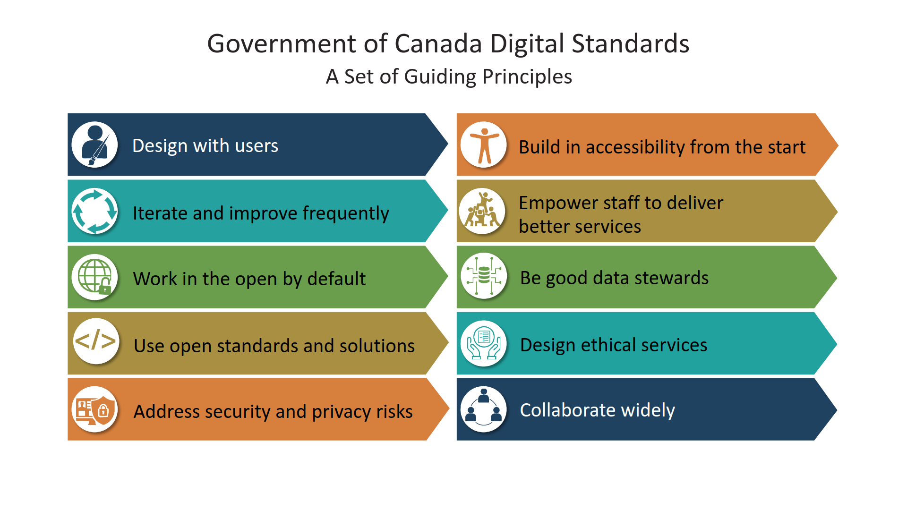
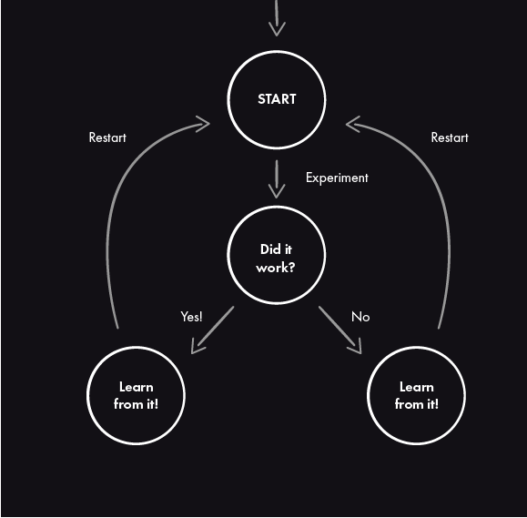
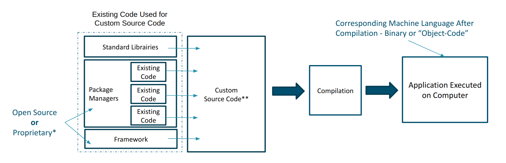
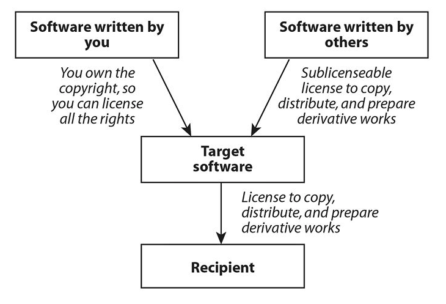
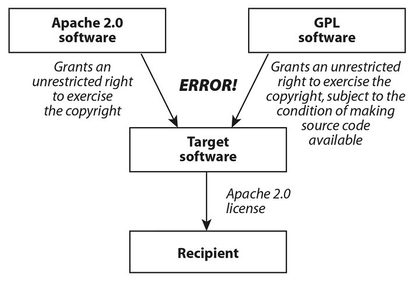
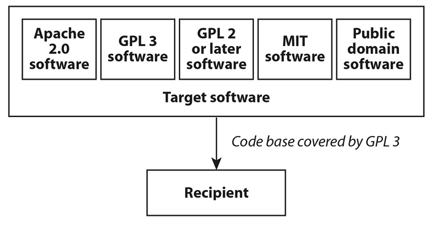

# GC Digital Pillars

<!--markdownlint-disable MD035-->

------

---

## Cloud

Note:

I won't sell you Cloud too much, there are many other sessions way more interesting than mine
From a Digital Standards perspective:

* Iterate and improve frequently
* Use open standards and solutions
* Address security and privacy risks

------

> Someone else's computer!

Note:

* Not really, it's a bit more complex than just that...
* Yes, someone else's infrastructure
* Also
  * Maintenance
  * Security
  * Account management
  * Billing
  * Etc.

------

### Scalability

* Performance on demand
  * Peak Times of the Week
  * Seasonal cycles
  * Short-term needs

------

### Automation

* Rinse and repeat
  * Standardisation
  * Known deployment configurations
* Infrastructure as code

------

### Time to market

* Main benefit still is **Time to Market**
* Around 5 minutes to spin a fully configured VM
* Days, Weeks to have a physical server delivered and configured
  * (Not bashing, just laws of physics)

------

Cloud is a modern way to manage deployment of your solutions:

> Leverage it

---

## DevOps

Note:
Digital Standards:

* Iterate and improve frequently
* Work in the open by default (inner source)
* Use open standards and solutions
* Address security and privacy risks
* Empower staff to deliver better services
* Collaborate widely

------

### 3 ways

1. Accelerate the delivery of value
2. Feedback Loops
3. Experimentation and Continuous Learning

------

#### Accelerate the delivery

> Go from left to right as fast as possible

1. Visualize the Work
2. Minimize Work In Progress
3. Automation Tools and Practices

Note:

1. Bug fixes, new feature, refactoring, etc.
2. Less WIP = Higher quality
3. Automated builds (no more build books...), infrastructure as code, etc.

------

#### Feedback Loops

> Feedback from right to left as fast as possible

* Continuous Integration (CI) and Continuous Delivery (CD):
  * Peer reviews (Pull Request!)
  * Automated tests (Known Security vulnerabilities, spelling, formatting, secret keys, patterns, licence compliance, etc.)

Note:

The limits here are your imagination and this can include practitioners from all around your DevOps.

------

#### Experimentation and Continual Learning

> Safe place to try, experiment and learn

* Tools
* Environment
* Time

Note:

I would also add "Safe space to share": Work in the open

------

------

This will need a cultural shift:

You're work is not just a checklist, you must add value and you need to provide continuous feedback

Note:

* Understand that you can't do it all alone
* We are all in it together
* More releases supports our views of a more robust product and service to our users

------

References:

* The DevOps Handbook:: How to Create World-Class Agility, Reliability, and Security in Technology Organizations
  * by Gene Kim, Jez Humble, Patrick Debois, John Willis
* [The 3 Ways for DevOps Practitioners](https://dzone.com/articles/the-3-ways-for-devops-practicioners)
* [The Three Ways of DevOps](https://medium.com/touch4it/the-three-ways-of-devops-b90abe6168ac)

---

## Open Source Software

>Software available under an open source licence.

For the purpose of the Government of Canada, we consider the Open Source Initiative's [definition](https://opensource.org/docs/definition.php) the current standard.

Note:

Digital Standards

* Iterate and improve frequently
* Work in the open by default
* Use open standards and solutions
* Address security and privacy risks
* Empower staff to deliver better services
* Collaborate widely

------

## Basic Rights

1. Use the software as you wish
2. Study the source code
3. Modify the source code
4. Redistribute the software

------

## Conditions

1. Notice
2. Derived work's licence

Note:

Depends on type of licence (see below)

------

## It's not open source

If you only have access to the source code.

>You **must** have the rights based on an open source licence.

---

## Types of Open Source Licences

------

### Permissive

>Allows you to do pretty much what you want with it and distribute it under different conditions than you obtained it.

------

### Reciprocal (Copyleft)

>Allow you to do pretty much the same but require you to redistribute on the same conditions under which you obtained it.

------

## Commonly known licences

* MIT License (Expat)
* Apache License 2.0 (Apache-2.0)
* BSD 3-Clause License (Revised)
* Mozilla Public License 2.0 (MPL-2.0)
* GNU General Public License v3 (GPL-3)
* GNU Affero General Public License v3 (AGPL-3.0)

Use [TL;DR Legal](https://tldrlegal.com)

Note:

* First three are permissive
* Last three are reciprocal

---

## Why bother

It looks like a lot of work...

------

## Why

Well, it's in the updated Directive on Management of IT, so I guess you should it...

------

* Don't start with a blank canvas, focus on the added value
* Speed up development time by reusing existing solutions to common problems
* Leverage a large community of peers to enhance quality and for wider maintenance
* Build on top of giants' shoulders and communities

------

> Aspiring to world class is not enough, when everyone else starts there

Jeff McAffer, formerly Director of Microsoft's Open Source Program Office

------

[2018 Open Source Security and Risk Analysis](https://www.synopsys.com/content/dam/synopsys/sig-assets/reports/2018-ossra.pdf), Synopsys Center for Open Source Research & Innovation

------

> 96 percent of the scanned [closed-source] applications contain open source components, with an average 257 components per application, and that

HelpNetSecurity - [The percentage of open source code in proprietary apps is rising](https://www.helpnetsecurity.com/2018/05/22/open-source-code-security-risk/)

------

> The average percentage of open source in the codebases of the applications scanned grew from 36% last year to 57%, suggesting that a large number of applications now contain much more open source than proprietary code.

HelpNetSecurity - [The percentage of open source code in proprietary apps is rising](https://www.helpnetsecurity.com/2018/05/22/open-source-code-security-risk/)

------

>It's all about software engineering economics

Stephen Walli, Principal Program Manager at Microsoft

---

## How

By using:

* Package Managers
  * NPM, Anaconda, Maven, CocoaPods, RubyGems, etc.
* Frameworks
  * Bootstrap, Spring, React.js, Spark, Django, .NET, etc.
* Social Development Platforms
  * GitHub, GitLab, BitBucket, GCcode*

---

## Be secure
  
* Know your dependencies
* Assess the components
* Patch your stuff!

Note:

Equifax - The vulnerability was known 2 months before the hack started...

------

## Resources

* MITRE's [Common Vulnerabilities and Exposures (CVE)](https://cve.mitre.org/)
* [U.S. National Vulnerability Database (NVD)](https://nvd.nist.gov/)

------

## Tools

* FOSSA
* JFrog X-Ray
* Sonatype
* Synopsys
* Etc.

---

## Be Compliant

* Know your dependencies
* Comply with T&Cs of the licences

------

## Rights and Responsibilities

Inbound vs Outbound

------

The terms and conditions under which you will be distributing your software must not exceed the terms and conditions associated with the licences of the software you will be using in your project.

>"Say what?"

------

------

Heather Meeker, _Open (Source) for Business: A Practical Guide to Open Source Software Licensing_, 51-56.

------

Heather Meeker, _Open (Source) for Business: A Practical Guide to Open Source Software Licensing_, 51-56.

------

Heather Meeker, _Open (Source) for Business: A Practical Guide to Open Source Software Licensing_, 51-56.

------

## Choice

Depends on:

* the open source components your using
* your business goals

------

## Recommended in the GC

* MIT License (Expat)
* Apache License 2.0 (Apache-2.0)
* GNU Lesser General Public License v3 (LGPL-3.0)
* GNU General Public License v3 (GPL-3)
* GNU Affero General Public License v3 (AGPL-3.0)

Source: [Guide: Select Open Source Software Licence](https://github.com/canada-ca/open-source-logiciel-libre/blob/master/en/guides/publishing-open-source-code.md#select-open-source-software-licence)
