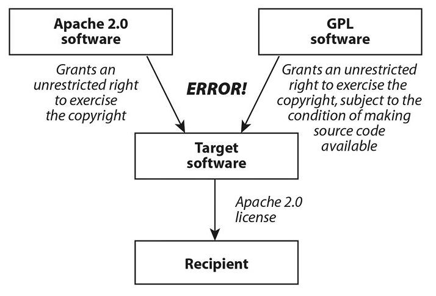
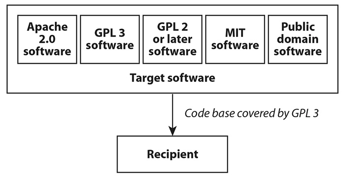

# Open Source Software

Using, Contributing, Publishing

--

[Draft Guidance](https://github.com/canada-ca/open-source-logiciel-libre/blob/master/README.md)

---

## Defintiion

>Software available under an open source licence.

For the purpose of the Government of Canada, we consider the Open Source Initiative's [definition](https://opensource.org/docs/definition.php) the current standard.

---

### Basic Rights

1. Use the software as you wish
2. Study the source code
3. Modify the source code
4. Redistribute the software

---

### Conditions

1. Notice
2. Derived work's licence

Note:

Depends on:

- type of licence (see below)
- what you are going to do with it

---

### It's not open source

If you only have access to the source code.

>You **must** have the rights based on an open source licence.

---

## Types of Open Source Licences

---

### Permissive

>Allows you to do pretty much what you want with it and distribute it under different conditions than you obtained it.

---

### Reciprocal (Copyleft)

>Allow you to do pretty much the same but require you to redistribute on the same conditions under which you obtained it.

---

## Commonly known licences

- MIT License (Expat)
- Apache License 2.0 (Apache-2.0)
- BSD 3-Clause License (Revised)
- Mozilla Public License 2.0 (MPL-2.0)
- GNU General Public License v3 (GPL-3)
- GNU Affero General Public License v3 (AGPL-3.0)

Use [TL;DR Legal](https://tldrlegal.com)

Note:

- First three are permissive
- Last three are reciprocal

--

## Using **without** modifications

---

[Excerpt from US Defense OSS FAQ](https://dodcio.defense.gov/Open-Source-Software-FAQ/#Q:_Is_open_source_software_commercial_software.3F_Is_it_COTS.3F):
> Open source software that has at least one non-governmental use, and has been or is available to the public, is commercial software. If it is already available to the public and is used unchanged, it is usually COTS.

---

| Standalone | Combination of components | Development and deployment |
| ---------- | ------------------------- | -------------------------- |
| Web browser, Productivity suite, Operating system and utilities (Window manager, Desktop environment, Text editor, Console..), .. | Application and plugins with database and web server | Custom development using open source software programming languages and dependencies, HTTP server, Database management system, Container platform |

---

### Support Model

Internal or External

---

- Project maintainers and Community are considered support.
- Private companies are available to offer contracted support services.

---

### Liability

>Software is provided 'as-is'

Rules of thumb: Consider the software with the same responsibility as if you had written it.

--

## Using **with** modifications

---

### Considerations

See [Draft Guidelines' section on Licences](https://github.com/canada-ca/open-source-logiciel-libre/blob/master/en/guides/using-open-source-software.md#verify-open-source-software-ownership-or-licence)

---

- Are there any reasons that would prevent the release of the modified source code?
- Is the modified application going to be used as a web application?
- Is the modified application going to be distributed externally, outside the GC, either the source code or the binary?

---

Heather Meeker, _Open (Source) for Business: A Practical Guide to Open Source Software Licensing_, 51-56.

---

Heather Meeker, _Open (Source) for Business: A Practical Guide to Open Source Software Licensing_, 51-56.

---

Heather Meeker, _Open (Source) for Business: A Practical Guide to Open Source Software Licensing_, 51-56.

---

### Why bother

> It looks like a lot of work...

Note:

- Manage thousands of licences already!
- Less complex than you may think
- Many solutions and services that can help you.

---

### A Few Reasons

- Don't start with a blank canvas, focus on the added value
- Speed up development time by reusing existing solutions to common problems
- Leverage a large community of peers to enhance quality and for wider maintenance
- Build on top of giants' shoulders and communities

Note:

- Some of these projects are built by the biggest companies in the world

---

> Aspiring to world class is not enough, when everyone else starts there

Jeff McAffer, formerly Director of Microsoft's Open Source Program Office

---

[2018 Open Source Security and Risk Analysis](https://www.synopsys.com/content/dam/synopsys/sig-assets/reports/2018-ossra.pdf), Synopsys Center for Open Source Research & Innovation

--

## Contributing to 3rd party projects

---

### Intellectual Property & Crown Copyright

Need permission because your work belongs to the Crown

---

### Licence

Your contributions should be under the same licence as the project

---

### Legal Requirements

Contributor Licence Agreement

---

### Why

It's the right thing to do

---

Transfer the maintenance back to the community

--

## Publishing your project as Open Source

---

1. Start as early as possible
2. Get approvals
3. Licence your work
4. Acquire the rights when contracting work
5. Work in the open

---

### Legacy Application

- Maybe a bit harder at firts
- Can be done in small iterations
- Opportunity to clean up your code

--

Thanks!
