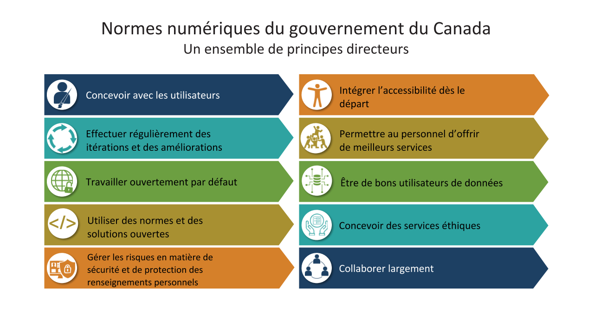

# Ouvert par défaut

**Guillaume Charest**

Conseiller principal, Emploi et développement social Canada

Rôle précédent: Lead pour le logiciel libre, Secrétariat du conseil du trésor du Canada

---

Présentation de la vision pour un gouvernement numérique et comment l’adoption d’une approche ouverte axée sur l’interopérabilité et la collaboration font partie intégrale de nos principes directeurs

--

[Lien vers le site des Normes numériques du gouvernement du Canada](https://www.canada.ca/fr/gouvernement/systeme/gouvernement-numerique/normes-numeriques-gouvernement-canada.html)

---

- [Travailler ouvertement part défaut]
- [Utiliser des normes et des solutions ouvertes]
- [Collaborer largement]

---

4 décembre 2018:

Mise à jour de la [Directive sur la gestion des technologies de l'information](https://www.tbs-sct.gc.ca/pol/doc-fra.aspx?id=15249) 

1 avril 2020:

Entrée en vigueur de la nouvelle [Directive sur les services et le numérique](https://www.tbs-sct.gc.ca/pol/doc-eng.aspx?id=32601)

---

[Annexe: Procédures obligatoires pour l'évaluation de l'architecture intégrée](https://www.tbs-sct.gc.ca/pol/doc-fra.aspx?id=32602)

---

[A.2.3.8 Utiliser des normes et des solutions ouvertes par défaut](https://www.tbs-sct.gc.ca/pol/doc-fra.aspx?id=32602#claA.2.3.8)

Note:

1. Logiciel libre
2. Logiciel propriétaire avec API, format données standard ouvert
3. Développement interne relâché publiquement sous licence libre

---

[A.2.3.9 Maximiser la réutilisation.](https://www.tbs-sct.gc.ca/pol/doc-fra.aspx?id=32602#claA.2.3.9)

Note:

- Exploiter et réutiliser les solutions, composantes et processus existants
- Solutions d'organisation > solution département
- Partager le code publiquement si possible

---

[A.2.3.10 Permettre l'interopérabilité](https://www.tbs-sct.gc.ca/pol/doc-fra.aspx?id=32602#claA.2.3.10)

Note:

- Exposer toutes les fonctionnalités en tant que services
- Exécuter chaque service de la TI dans son propre processus
- Exécuter des applications dans des conteneurs
- Plateforme d'échange numérique du GC pour les composants tels que l'IPA Store, la messagerie et le bus de service du GC.

--

## Logiciels libres

---

>Logiciel disponible sous une licence libre

Jusqu'à présent, les guides établis au GC considèrent les licences de la Open Source Initiative et de la Free Software Foundation comme les seules licences acceptées.

---

### Droits de base

1. Utiliser le logiciel comme vous le voulez
2. Étudier le code source
3. Modify the source code
4. Redistribute the software

--

### Utilisation

--

## Open Source Software

>Software available under an open source licence.

For the purpose of the Government of Canada, we consider the Open Source Initiative's [definition](https://opensource.org/docs/definition.php) the current standard.

--

## Basic Rights

1. Use the software as you wish
2. Study the source code
3. Modify the source code
4. Redistribute the software

--

## Conditions

1. Notice
2. Derived work's licence

Note:

Depends on type of licence (see below)

--

## It's not open source

If you only have access to the source code.

>You **must** have the rights based on an open source licence.

---

## Types of Open Source Licences

--

### Permissive

>Allows you to do pretty much what you want with it and distribute it under different conditions than you obtained it.

--

### Reciprocal (Copyleft)

>Allow you to do pretty much the same but require you to redistribute on the same conditions under which you obtained it.

--

## Commonly known licences

* MIT License (Expat)
* Apache License 2.0 (Apache-2.0)
* BSD 3-Clause License (Revised)
* Mozilla Public License 2.0 (MPL-2.0)
* GNU General Public License v3 (GPL-3)
* GNU Affero General Public License v3 (AGPL-3.0)

Use [TL;DR Legal](https://tldrlegal.com)

Note:

* First three are permissive
* Last three are reciprocal

---

## Using

without modifications

--

>Provided 'as-is'

Consider the software with the same responsibility lenses as if you had written it.

--

[Excerpt from US Defense OSS FAQ](https://dodcio.defense.gov/Open-Source-Software-FAQ/#Q:_Is_open_source_software_commercial_software.3F_Is_it_COTS.3F):
> Open source software that has at least one non-governmental use, and has been or is available to the public, is commercial software. If it is already available to the public and is used unchanged, it is usually COTS.

--

| Standalone | Combination of components | Development and deployment |
| ---------- | ------------------------- | -------------------------- |
| Web browser, Productivity suite, Operating system and utilities (Window manager, Desktop environment, Text editor, Console..), .. | Application and plugins with database and web server | Custom development using open source software programming languages and dependencies, HTTP server, Database management system, Container platform |

--

# Support Model

Internal or External

---

## Using

with modifications

--

## Considerations

See [Draft Guidelines on Licences](https://github.com/canada-ca/open-source-logiciel-libre/blob/master/en/guides/using-open-source-software.md#verify-open-source-software-ownership-or-licence)

--

You're working in the open:

--

## Why bother

> It looks like a lot of work...

--

Technically, you manages thousands of licences already...

--

* Don't start with a blank canvas, focus on the added value
* Speed up development time by reusing existing solutions to common problems
* Leverage a large community of peers to enhance quality and for wider maintenance
* Build on top of giants' shoulders and communities

--

> Aspiring to world class is not enough, when everyone else starts there

Jeff McAffer, formerly Director of Microsoft's Open Source Program Office

-- 

[2018 Open Source Security and Risk Analysis](https://www.synopsys.com/content/dam/synopsys/sig-assets/reports/2018-ossra.pdf), Synopsys Center for Open Source Research & Innovation
